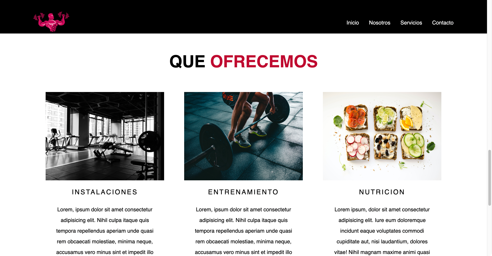
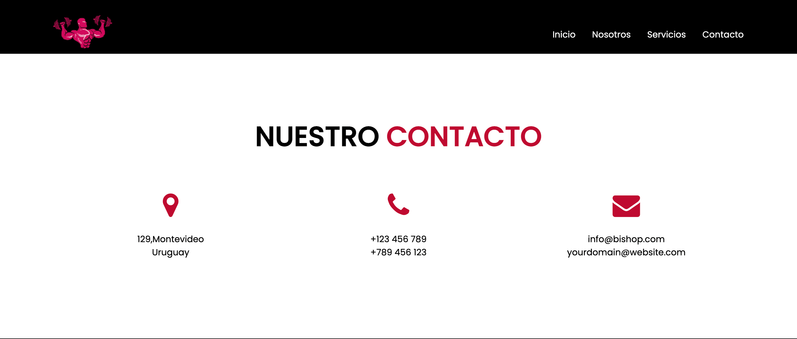

# Clase Practica de CSS y HTML

## Sobre este ejercicio

Este proyecto tiene una página de inicio con una barra de navegación. Hay un titular y un subtítulo como contenido del banner en la página de inicio. También se ha agregado un botón de llamado a la acción (Mas informacion). La sección "Acerca de nosotros" tiene una imagen a la izquierda y contenido de texto relacionado a la derecha. Se ha utilizado un encabezado de sección en casi todas las secciones. La siguiente sección tiene un mensaje para los visitantes. Esta sección utiliza una imagen de fondo y una superposición. La siguiente sección es la sección de servicios. En esta sección, se han alineado tres divs a través de CSS Flexbox. Se toma una imagen, texto de encabezado y texto de párrafo en cada div. Se han agregado dirección, número de teléfono y dirección de correo electrónico en tres columnas en la sección de contacto. Finalmente, se ha agregado texto de derechos de autor en la sección de pie de página. Hemos tomado el contenido del sitio web según lo consideremos apropiado.

### HTML

Primero creamos la sección del encabezado. En esta sección, tomamos todos los elementos de la navegación principal. A continuación, tomamos seis secciones consecutivas. Son `banner-area`, `about-area`, `message-area`, `services-area`, `contact-area` y `footer`. En la zona del banner, tomamos un `div` para la imagen de fondo y algunos contenidos del banner. A partir de las secciones siguientes, tomamos el contenido relacionado con el ID correspondiente. Para dar el efecto de desplazamiento, se ha vinculado los IDs de las secciones con los elementos de la navegación principal.

### CSS
Para eliminar el margen y el relleno predeterminados del proyecto, primero tomamos el selector universal y agregamos `margin: 0` y `padding: 0`. Luego, tuvimos que alinear los elementos de cada sección a través de CSS flexbox. Después de dar estilo a cada sección, utilizamos consultas de medios CSS para darle un aspecto receptivo.

## Tarea

Les invito a clonar este repositorio, analizar el codigo ya hecho y culminar las secciones faltantes de `services-area`, `contact-area` y `footer`.

### services-area
#### Pista:
El HTML de esta seccion esta compuesto por un `h3` para el titulo, un `ul` como contenedor de cada servicio compuesto de un `li`

### contact-area
#### Pista
El HTML de esta seccion esta compuesto por un `h3` para el titulo, un `ul` como contenedor de cada servicio compuesto de un `li`
La clase de los iconos usados son:
- `fa fa-map-marker`
- `fa fa-phone`
- `fa fa-envelope`

### Footer

